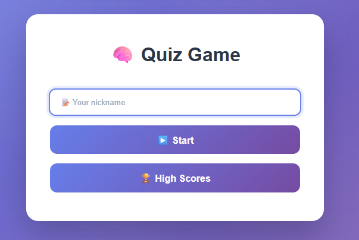

# Assignment2: 🧠 Quiz Game

* Student: Yasaman Naghiloo
* Email: Yn222cp@student.lnu.se
* Course: 1DV528

 

This​‍​‌‍​‍‌​‍​‌‍​‍‌ is a straightforward, browser-based quiz game that uses only JavaScript, HTML, and CSS with no frameworks. Vite was used as the development tool. The game shows you a set of questions that can either be multiple choice or text input, and it tracks how quickly you can answer them. Your finish time is recorded, so you can race against your previous self or other players by looking at the high ​‍​‌‍​‍‌​‍​‌‍​‍‌scores.

## How to download and run
1. Clone the repo to your computer

```git@gitlab.lnu.se:1dv528/student/yn222cp/a2-quiz.git```

2. Go to the project folder

```cd a2-quiz```

3. Install dependencies

```npm install```

4. Start the development server

```npm run dev```

5. To see the production build, run:

```npm run build```

Then:

```npm run server```

6. Use the given URL to start the quiz


## How to play?
1. Enter your nickname and press Enter or click Start

2. Answer the questions as fast as you can

3. You have a countdown timer for each question. If time runs out, the game ends

4. Finish all questions to see your time score, which is saved to high scores as well

5. You can wither restar the game or check highscores history


## Linters and code quality

This​‍​‌‍​‍‌​‍​‌‍​‍‌ project includes linters by default to assist in maintaining clean and consistent code. You may execute all linters simultaneously with `npm run lint` to check your code. This will fetch the errors thrown by or style issues in the HTML, CSS, and JavaScript files. Where it is feasible, you may also fix the issues thus a command like `npm run stylelint:fix` can be used for CSS and another one like `npm run eslint:fix` for JavaScript. Using these linters frequently is a good habit as it helps your code to be in compliance with coding standards, it also prevents you from making the same types of errors, and it keeps the project at a level that is easy to work ​‍​‌‍​‍‌​‍​‌‍​‍‌with.